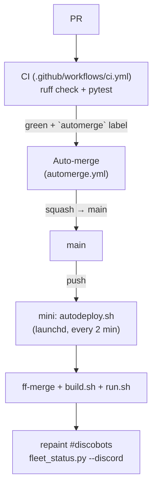

# CI/CD

discobots ships through a three-stage pipeline modelled on obsidian-automations'
(the proven lane). A change lands on the mini — and repaints the **#discobots**
inventory board — within ~2 minutes of merge, unattended.



## 1. CI — the gate

`.github/workflows/ci.yml` runs on every PR and push to `main`: `uv sync --group
dev`, then `ruff check ops/` + `pytest`. Config lives in `pyproject.toml` (ruff
line-length 110 / py312, correctness rules `E,F`; pytest `testpaths = ops/tests`).
Red CI blocks the merge. Runtime deps (`httpx`, `influxdb-client`, `redis`) mirror
`ops/docker/base.Dockerfile`; keep them in step.

## 2. Auto-merge — hands-off landing

`.github/workflows/automerge.yml` squash-merges a PR **only** when it carries the
`automerge` label AND every check is green. Label-gated, so nothing merges by
surprise; it runs from `main`'s copy of the file, so a PR can't rewrite the merge
logic. (Grants `checks: read` + `statuses: read` — without them the rollup query
throws; that was the bug the obsidian lane hit.) Unlabelled PRs merge the normal
way — review, then `gh pr merge` / the GitHub UI.

Create the label once: `gh label create automerge -R tommyroar/discobots -c 0e8a16`.

## 3. CD — the mini ships main + repaints the board

`ops/autodeploy.sh` runs on the mini via launchd (`com.discobots.autodeploy`,
every 2 min). Each tick, if `origin/main` moved: ff-merge it, `ops/build.sh`,
`ops/run.sh`, then repaint the pinned **#discobots** panel from `ops/fleet.toml`
(`fleet_status.py --discord`). Best-effort and logged (`/tmp/discobots-autodeploy.log`);
it only acts on a clean checkout on `main`, and a no-move tick is a cheap fetch.

```sh
just autodeploy-install     # install + load the poller on the mini
just autodeploy-status      # is it loaded? last exit?
just autodeploy-log         # tail the deploy log
just autodeploy-uninstall   # remove it
```

`just deploy` (push + pull + build) still works for a manual push.

## The #discobots inventory board

`ops/fleet.toml` is the single source of truth for the fleet (bots, collectors,
data sources, graph kit). `fleet_status.py` renders it to both the pinned
**#discobots** Discord panel and `docs/fleet-status.md` (the dev-wiki page); a test
(`test_committed_page_is_in_sync`) welds the two. The CD poller repaints the panel
on every deploy, so the board tracks the fleet automatically.

**One-time hands (needs `MANAGE_WEBHOOKS`):** create the **#discobots** channel +
a webhook, and add `DISCORD_WEBHOOK_DISCOBOTS=…` to `~/dev/observability/grafana/.env`
on the mini. Until it exists the board falls back to #ops (so nothing breaks).
